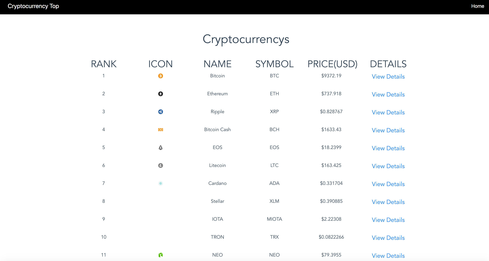
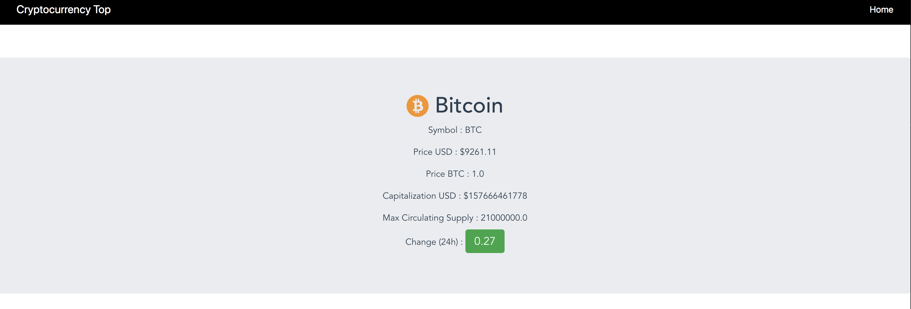

# crypto_top

>aplicación que despliega el top 20 de las criptomonedas en Coinmarketcap y permite ver el detalle de la criptomoneda seleccionada usando Vue.js
>puedes seguir paso a paso este ejemplo en :http://www.proflema.com/index.php/2018/05/09/crear-top-criptomonedas-vuejs-2/



## Build Setup

``` bash
# install dependencies
npm install

# serve with hot reload at localhost:8080
npm run dev

# build for production with minification
npm run build

# build for production and view the bundle analyzer report
npm run build --report
```

For a detailed explanation on how things work, check out the [guide](http://vuejs-templates.github.io/webpack/) and [docs for vue-loader](http://vuejs.github.io/vue-loader).
